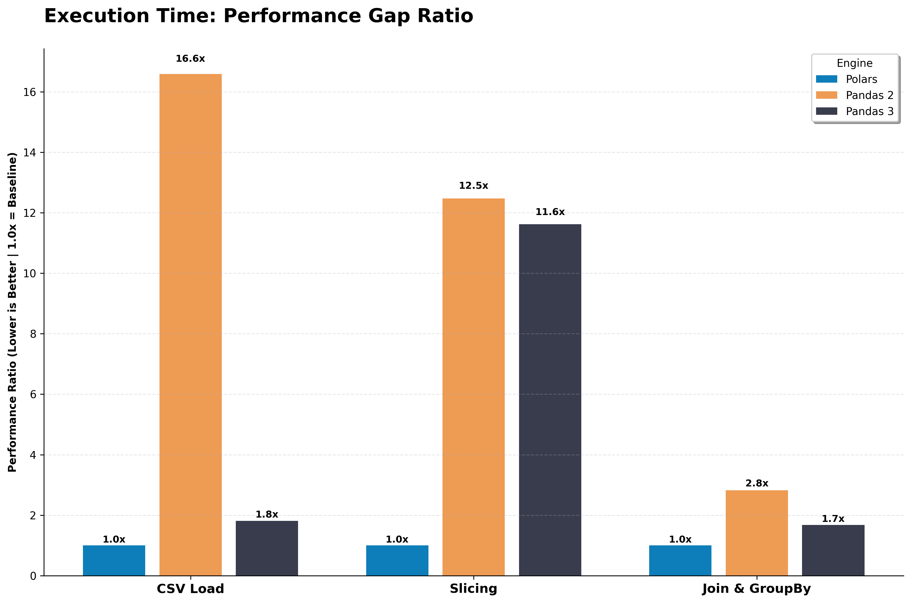
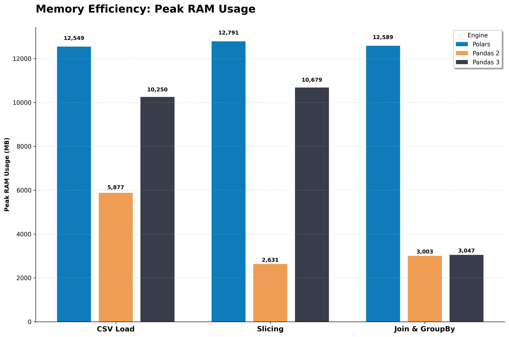

# 🐼 vs 🐻‍❄️: The Data Library Showdown
### Benchmarking Pandas 2.2, Pandas 3.0, and Polars

## Overview
As a Master’s student in Data Engineering, I’ve watched the "Data Library Wars" closely. For years, **Pandas** was the "Mama Bear" of Python—reliable but occasionally sluggish as datasets grew. Then **Polars** arrived from the "Rust"y north, promising blazingly fast, multi-threaded performance.

With the release of **Pandas 3.0**, the game has changed. This repository contains a 3-part simulation designed to measure if Pandas has finally closed the gap.

##  The Experiment
The benchmark consists of three distinct "Grizzly" battles:
1. **Part A (I/O):** Reading a 2GB+ CSV to test load times and peak RAM.
2. **Part B (Manipulation):** Heavy slicing and dicing to test execution engines.
3. **Part C (The Join):** Complex multi-key joins and aggregations.

##  Key Results

### 1. The 90% Speed Boost (I/O)
The most "un-bear-able" discovery was the jump from Pandas 2.2 to 3.0. By defaulting to **PyArrow** and **Copy-on-Write (CoW)**, Pandas 3.0 slashed reading times by nearly **90%**.

| Library | Load Time (sec) | Peak Memory (MB) |
| :--- | :--- | :--- |
| **Pandas 2.2** | 35.51s | 5876.9 |
| **Pandas 3.0** | 3.89s | 10249.8 |
| **Polars** | 2.14s | 12548.7 |



### 2. Processing & Memory Efficiency
While **Polars** remains the "Apex Predator" of raw processing speed (Part B), **Pandas 3.0** showed incredible resilience in memory management during complex joins.

* **Slicing Speed:** Polars was ~10x faster than Pandas 3.0 (0.03s vs 0.38s).
* **The Memory Surprise:** During Part C (Joins), Polars spiked to **12.5GB**, while Pandas 3.0 managed the same operation with only **3.0GB**.



##  Summary & Verdict
* **Don't Hibernate on Pandas 3.0:** If you’re still using 2.x, you are "barely" scratching the surface of available performance. The 90% improvement in I/O makes it a modern powerhouse.
* **Polars for the Polar Express:** If your bottleneck is raw CPU execution and you have the RAM to spare, the Rust-backed engine is still king.
* **The "Bear" Necessities:** For most ML workflows, Pandas 3.0 is now lean enough to compete while maintaining its massive ecosystem of tools.

##  Usage
1. Ensure you have the results JSONs in the root directory.
2. Install dependencies:
   ```bash
   pip install pandas==3.0.0rc0 polars==1.37.1 pyarrow
